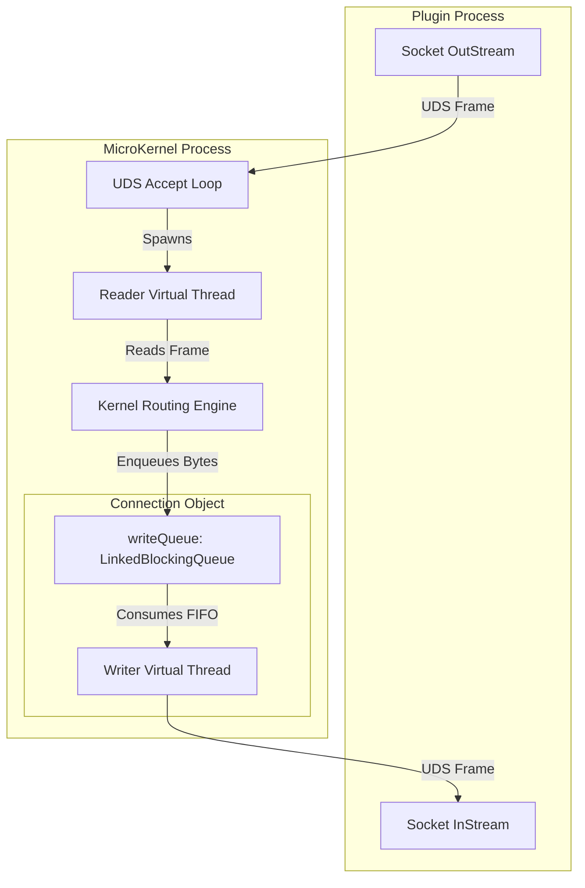
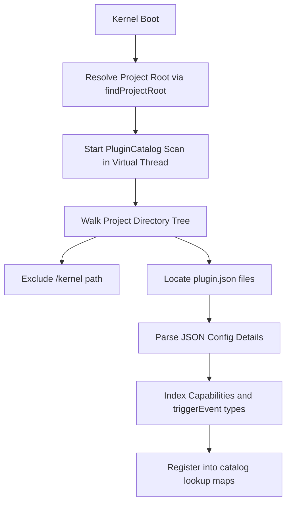

# Core Kernel Architecture

This document details the internal architecture, network framing, threading model, and routing mechanisms of the MK8 MicroKernel.

---

## 1. Architectural Model: Producer-Consumer

The MK8 MicroKernel is implemented as a high-performance, asynchronous, non-blocking **Producer-Consumer** event router. Instead of routing messages synchronously over blocking sockets, the Kernel decouples reading from writing by introducing dedicated, thread-safe memory queues for every active connection.

### Thread and Queue Topology



---

## 2. UDS Network Framing Protocol

To transmit JSON payloads over a continuous Unix Domain Socket (UDS) byte stream safely, the Kernel implements a length-prefixed framing protocol. This design prevents packet fragmentation errors and eliminates the overhead of parsing raw delimiters.

### Frame Layout

```
┌───────────────────────────┬───────────────────────────────────────────┐
│ Length Header (4 Bytes)   │ Payload Content (N Bytes)                 │
│ Big-Endian 32-bit Integer │ UTF-8 Encoded JSON Event String           │
└───────────────────────────┴───────────────────────────────────────────┘
```

- **Reading Flow**: The reader reads exactly 4 bytes from the UDS input stream, decodes them to resolve the payload size ($N$), and then reads exactly $N$ bytes to isolate the complete JSON string.
- **Writing Flow**: The writer calculates the UTF-8 byte length of the JSON string, writes the length as a 4-byte big-endian integer, followed immediately by the JSON bytes, and flushes the stream.

---

## 3. Event Envelope Structure

All data packets passing through the Kernel must conform to a standardized JSON schema. This envelope separates metadata routing properties from the raw application payload.

### Schema Fields
- `id` (string): Unique identifier (UUID) generated per event.
- `type` (string): Routing key (e.g., `capability.invoke`).
- `payload` (string): Stringified or serialized JSON data.
- `timestamp` (string): ISO 8601 creation timestamp.
- `source` (string): Unique identifier of the originating plugin.
- `correlationId` (string): Correlation key used to route responses back to callers asynchronously.
- `sessionId` (string): Conversation context identifier.
- `workflowId` (string): Workflow execution path tracker.
- `replyTo` (string): Intended recipient plugin ID.
- `traceId` (string): Distributed tracing transactional identifier.
- `spanId` (string): Distributed tracing execution step identifier.

### Event Payload Example

```json
{
  "id": "7ca62fee-cf82-4ad3-9ef4-d36cb07f18b3",
  "type": "capability.invoke",
  "payload": "{\"name\":\"text.analyze\",\"text\":\"An old silent pond...\"}",
  "timestamp": "2026-05-30T13:45:00.123Z",
  "source": "demo-runner",
  "correlationId": "haiku-collapsed-id",
  "sessionId": "demo-session",
  "traceId": "9e1c1284-848f-4318-8f8b-f925239dfc82",
  "spanId": "9e1c1284-848f-4318-8f8b-f925239dfc82"
}
```

---

## 4. Virtual Threading and Queuing Topology

The Kernel leverages Java Virtual Threads (JDK 21+) to achieve high concurrency without the overhead of platform operating system threads.

### 1. Reader Thread (Per Connection)
- When a socket connection is accepted, the Kernel spawns a dedicated Virtual Thread.
- **Loop**: Reads incoming frames sequentially from `InputStream`.
- **Action**: Passes parsed JSON events to the `Kernel.route()` routine.
- **Lifecycle**: Terminates when the client disconnects (EOF reached on stream).

### 2. Writer Queue and Thread (Per Connection)
- Every connection instantiates a `LinkedBlockingQueue<byte[]>` (`writeQueue`) acting as a FIFO buffer.
- A dedicated Virtual Thread (`runWriter`) blocks on the queue.
- **Loop**: `writeQueue.take()` retrieves the next binary frame.
- **Action**: Writes the frame to the socket `OutputStream` and flushes.
- **Poison Pill Cleanup**: To shut down a connection safely, the Kernel pushes a special `POISON` byte array into the queue. Once the writer thread encounters the poison pill, it terminates the socket gracefully.

---

## 5. Event Interception Pipeline (Callbacks)

The MK8 Kernel-Extendido introduces a stateful interception pipeline. Interceptors are executed within `Kernel.route()` after logging the request but *before* matching subscriptions or executing broadcasts.

### Execution Chain Flow

```
Incoming Event
     │
     ▼
 pendingRoutes Map Updated (For capability.invoke and blackboard.read)
     │
     ▼
[IdempotencyInterceptor]
     │
     ├──[Cache Hit / Collapsed] ──► [Direct Send to Callers] ──► (Halt Routing)
     ▼ [Cache Miss / In-Flight Init]
[CapabilityIndex]
     │
     ├──[No Live Provider] ──────► [Spawn Request (plugin.load)] ─► (Halt Routing)
     ▼ [Active Provider Resolved]
[ProcessManager]
     │
     ├──[Lifecycle Match] ───────► [Spawn/Stop Child Process] ──► (Halt Routing)
     ▼ [No Matches]
Standard Broadcast Phase (Exact Match & Wildcard Prefix Search)
     │
     ▼
Delivery to writeQueue of matching Plugins
```

If any interceptor returns `true` from `intercept()`, the event is consumed. The routing loop stops instantly, preventing downstream interceptors and standard broadcasts from executing.

---

## 6. Dynamic Plugin Discovery

Plugins are decoupled from the Kernel codebase and discovered dynamically at boot.



### Discovery Heuristics
1. **Root Resolution**: The Kernel walks up directories starting from the current working directory (`user.dir`) searching for a `kernel` subdirectory or a `Start.java` anchor.
2. **Directory Scanning**: The `PluginCatalog` walks the resolved project root recursively, filtering for files named `plugin.json` while explicitly ignoring the `kernel/` folder.
3. **Hot Reloading**: When a `plugin.installed` event is published, the `PluginCatalog` performs a synchronous re-scan inline, refreshing the indexed mappings in real-time.
